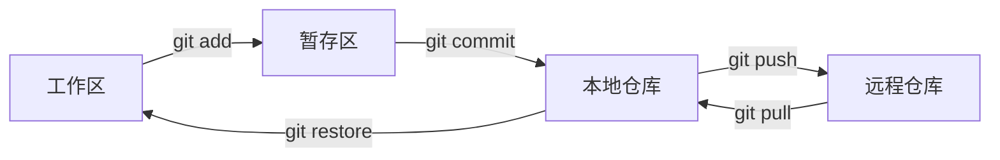
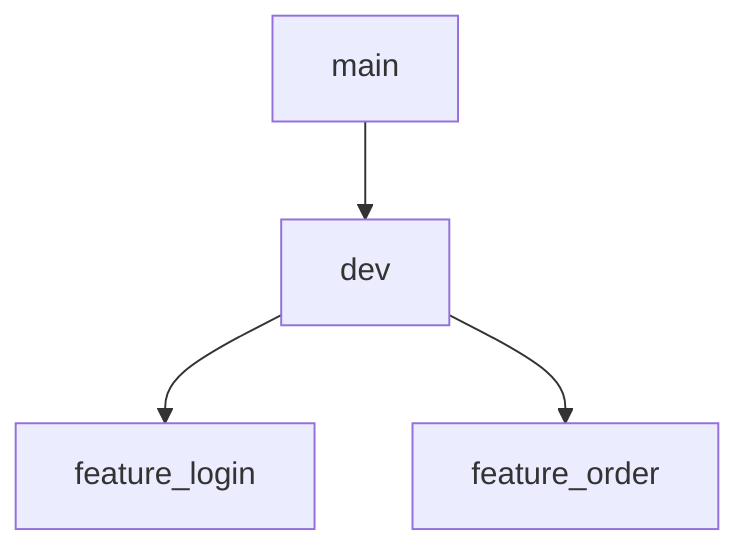
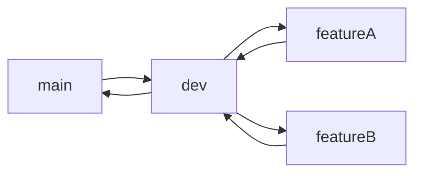
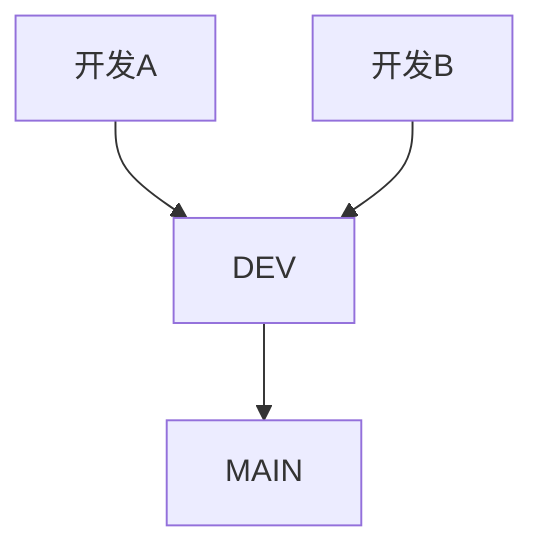

---

title: Git 使用指南（流程 + 实战 + 进阶）
description: 一篇覆盖 Git 核心概念、工作流、冲突处理与进阶技巧的高质量指南
outline: deep
lastUpdated: true
-----------------

# 🚀 Git 使用指南

> 面向实际开发的 Git 全流程指南：从基础命令 → 工作流 → 冲突处理 → 进阶技巧，一篇搞定。

:::tip 核心一句话
**Git = 快照系统（commit） + 指针系统（branch） + 合并机制（merge / rebase）**
:::

---

## 🧱 工作模型（必须理解）



:::details 关键概念说明

* 工作区：你正在编辑的文件
* 暂存区：提交前的缓冲层（精确控制提交内容）
* 本地仓库：版本历史
* 远程仓库：团队协作中心
  :::

---

## ⚙️ 环境配置

```bash
# 基础身份
git config --global user.name "Your Name"
git config --global user.email "your@email.com"

# 推荐配置
git config --global core.editor vim
git config --global color.ui auto
```

:::tip 建议
为不同项目配置不同邮箱：使用 `--local` 级别覆盖。
:::

---

## 📦 基础操作

::: code-group

```bash [初始化]
git init
```

```bash [克隆]
git clone <repo>
```

```bash [提交]
git add .
git commit -m "feat: add login api"
```

:::

:::tip Commit 规范

* feat：新功能
* fix：修复
* docs：文档
* refactor：重构
  :::

---

## 🌿 分支管理



```bash
# 创建与切换
git switch -c feature/login

# 合并
git switch dev
git merge feature/login
```

:::warning 注意
不要在 `main` 分支直接开发。
:::

---

## 🔗 远程仓库

```bash
# 绑定远程
git remote add origin <url>

# 推送
git push -u origin main

# 拉取
git pull
```

---

## ⚠️ 冲突解决（实战）

```diff
<<<<<<< HEAD
你的代码
=======
同事代码
>>>>>>> branch
```

```bash
git pull
# 手动解决冲突
git add .
git commit -m "fix: resolve conflict"
```

:::tip 实战经验

* 高频 pull
* 拆小文件，减少冲突
  :::

---

## ⏪ 版本回退

```bash
# 查看历史
git log --oneline

# 回退（危险）
git reset --hard HEAD~1
```

:::warning 风险
`--hard` 会丢失修改，谨慎使用。
:::

更安全方式：

```bash
git revert <commit>
```

---

## 🧹 撤销操作

```bash
# 撤销工作区
git restore file

# 撤销暂存区
git reset HEAD file
```

---

## 🧠 推荐工作流（企业常用）



```bash
# 1. 切分支
git switch dev
git switch -c feature/login

# 2. 开发
git add .
git commit -m "feat: login"

# 3. 合并
git switch dev
git merge feature/login

# 4. 发布
git switch main
git merge dev
```

---

## 🔥 进阶技巧

### stash

```bash
git stash
git stash pop
```

### rebase

```bash
git rebase dev
```

| 操作     | 特点   |
| ------ | ---- |
| merge  | 保留分叉 |
| rebase | 线性历史 |

### cherry-pick

```bash
git cherry-pick <commit>
```

---

## 🧪 多人协作案例



```bash
# A
git switch -c feature/a

# B
git switch -c feature/b

# 合并 + 冲突
git pull
```

---

## 📊 命令速查

| 分类  | 命令         |
| --- | ---------- |
| 初始化 | git init   |
| 克隆  | git clone  |
| 提交  | git commit |
| 状态  | git status |
| 分支  | git switch |
| 合并  | git merge  |
| 推送  | git push   |
| 拉取  | git pull   |

---

## 💡 最佳实践

:::tip 推荐

* 小步提交
* 分支开发
* 规范 commit message
  :::

:::warning 避坑

* main 上开发
* 不写 commit 信息
* 滥用 force push
  :::

---

## 🎯 总结

> Git 核心三件事：

* commit
* branch
* merge / rebase

---

## 📎 进阶学习

* Git Hooks
* CI/CD
* Submodule

---